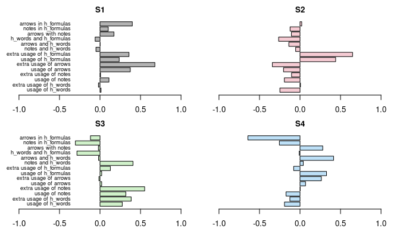

# Abstract

Effective signaling in instructional materials—through cues such as
highlights, arrows, and annotations—can guide learner attention, reduce
cognitive load, and enhance comprehension in multimedia-rich online
courses. While the benefits of signaling are well documented, little is
known about how combinations of signaling strategies influence both the
average performance and the consistency of student outcomes. In this
study, we propose a data-driven approach to evaluate and optimize
signaling strategies in online teaching. Using lecture materials from
three semesters of introductory and intermediate statistics courses, we
extracted multiple features of textual and visual signaling, including
highlighted words, annotated formulas, arrows, and notes. Principal
Component Analysis identified four distinct signaling strategies
employed by the instructor. We then applied a heteroscedastic beta
regression model to link these strategies to topic-level exam
performance, allowing simultaneous assessment of mean learning outcomes
and variability across students. Results show that strategies combining
formula highlighting with arrows and detailed notes improve both the
average proportion of successful learners and the stability of outcomes,
while relying solely on formula highlighting increases variability. Our
findings provide actionable guidance for instructors to design effective
signaling strategies, and demonstrate a flexible framework for
data-driven evaluation of teaching practices in online learning
environments.

# Data Preprocessing and Extracting Singaling Strategies

-   downloading the data

-   scaling the data

-   downloading the responses

-   extracting the signaling strategies

-   plotting the PC loadings

Bar plots showing the feature weights for the four signaling strategies
extracted by PCA. The labels correspond to the underlying observed
variables, while the term “extra” indicates weights associated with the
squared versions of these variables.

# Beta Regression with Heteroscedasticity

-   regression results

<table>
<caption>Heteroscedastic Beta Regression Results for Mean and Precision
Components.</caption>
<thead>
<tr class="header">
<th style="text-align: left;">component</th>
<th style="text-align: left;">term</th>
<th style="text-align: left;">estimate</th>
<th style="text-align: left;">std.error</th>
<th style="text-align: left;">statistic</th>
<th style="text-align: left;">p.value</th>
</tr>
</thead>
<tbody>
<tr class="odd">
<td style="text-align: left;">mean</td>
<td style="text-align: left;">(Intercept)</td>
<td style="text-align: left;">0.6305</td>
<td style="text-align: left;">0.1248</td>
<td style="text-align: left;">5.0528</td>
<td style="text-align: left;">0.0000</td>
</tr>
<tr class="even">
<td style="text-align: left;">mean</td>
<td style="text-align: left;">complex</td>
<td style="text-align: left;">-0.7186</td>
<td style="text-align: left;">0.1534</td>
<td style="text-align: left;">-4.6854</td>
<td style="text-align: left;">0.0000</td>
</tr>
<tr class="odd">
<td style="text-align: left;">mean</td>
<td style="text-align: left;">S1</td>
<td style="text-align: left;">0.1137</td>
<td style="text-align: left;">0.0212</td>
<td style="text-align: left;">5.3628</td>
<td style="text-align: left;">0.0000</td>
</tr>
<tr class="even">
<td style="text-align: left;">mean</td>
<td style="text-align: left;">S2</td>
<td style="text-align: left;">0.1650</td>
<td style="text-align: left;">0.0531</td>
<td style="text-align: left;">3.1067</td>
<td style="text-align: left;">0.0019</td>
</tr>
<tr class="odd">
<td style="text-align: left;">mean</td>
<td style="text-align: left;">S3</td>
<td style="text-align: left;">0.0700</td>
<td style="text-align: left;">0.0300</td>
<td style="text-align: left;">2.3374</td>
<td style="text-align: left;">0.0194</td>
</tr>
<tr class="even">
<td style="text-align: left;">mean</td>
<td style="text-align: left;">S4</td>
<td style="text-align: left;">0.2514</td>
<td style="text-align: left;">0.0542</td>
<td style="text-align: left;">4.6340</td>
<td style="text-align: left;">0.0000</td>
</tr>
<tr class="odd">
<td style="text-align: left;">precision</td>
<td style="text-align: left;">(Intercept)</td>
<td style="text-align: left;">2.4448</td>
<td style="text-align: left;">0.2596</td>
<td style="text-align: left;">9.4191</td>
<td style="text-align: left;">0.0000</td>
</tr>
<tr class="even">
<td style="text-align: left;">precision</td>
<td style="text-align: left;">complex</td>
<td style="text-align: left;">-0.1699</td>
<td style="text-align: left;">0.4059</td>
<td style="text-align: left;">-0.4185</td>
<td style="text-align: left;">0.6756</td>
</tr>
<tr class="odd">
<td style="text-align: left;">precision</td>
<td style="text-align: left;">S1</td>
<td style="text-align: left;">0.4540</td>
<td style="text-align: left;">0.1032</td>
<td style="text-align: left;">4.4012</td>
<td style="text-align: left;">0.0000</td>
</tr>
<tr class="even">
<td style="text-align: left;">precision</td>
<td style="text-align: left;">S2</td>
<td style="text-align: left;">-0.2912</td>
<td style="text-align: left;">0.1244</td>
<td style="text-align: left;">-2.3402</td>
<td style="text-align: left;">0.0193</td>
</tr>
<tr class="odd">
<td style="text-align: left;">precision</td>
<td style="text-align: left;">S3</td>
<td style="text-align: left;">0.4463</td>
<td style="text-align: left;">0.1531</td>
<td style="text-align: left;">2.9156</td>
<td style="text-align: left;">0.0035</td>
</tr>
<tr class="even">
<td style="text-align: left;">precision</td>
<td style="text-align: left;">S4</td>
<td style="text-align: left;">0.1141</td>
<td style="text-align: left;">0.1856</td>
<td style="text-align: left;">0.6147</td>
<td style="text-align: left;">0.5388</td>
</tr>
</tbody>
</table>

Heteroscedastic Beta Regression Results for Mean and Precision
Components.

-   summaries for the parameters

<table>
<caption>Summaries of the estimated means and standard deviations of the
resulting beta distributions.</caption>
<colgroup>
<col style="width: 9%" />
<col style="width: 12%" />
<col style="width: 22%" />
<col style="width: 10%" />
<col style="width: 10%" />
<col style="width: 22%" />
<col style="width: 12%" />
</colgroup>
<thead>
<tr class="header">
<th style="text-align: left;"></th>
<th style="text-align: left;">minimum</th>
<th style="text-align: left;">lower quartile</th>
<th style="text-align: left;">median</th>
<th style="text-align: left;">mean</th>
<th style="text-align: left;">upper quartile</th>
<th style="text-align: left;">maximum</th>
</tr>
</thead>
<tbody>
<tr class="odd">
<td style="text-align: left;">means</td>
<td style="text-align: left;">0.2695</td>
<td style="text-align: left;">0.5013</td>
<td style="text-align: left;">0.6100</td>
<td style="text-align: left;">0.6116</td>
<td style="text-align: left;">0.7293</td>
<td style="text-align: left;">0.9301</td>
</tr>
<tr class="even">
<td style="text-align: left;">sds</td>
<td style="text-align: left;">0.0067</td>
<td style="text-align: left;">0.1177</td>
<td style="text-align: left;">0.1601</td>
<td style="text-align: left;">0.1440</td>
<td style="text-align: left;">0.1883</td>
<td style="text-align: left;">0.2016</td>
</tr>
</tbody>
</table>

Summaries of the estimated means and standard deviations of the
resulting beta distributions.

-   selected shapes

Fitted beta distribution densities for a selection of teaching cases,
illustrating variation in mean and scale parameters across the modelled
topics.

-   the estimated mean parameters versus the strategy scores

<table>
<caption>Average strategy scores for the four signaling strategies
across different ranges of the fitted mean parameter <em>μ</em> indicating how strategy usage
relates to topic-level performance.</caption>
<thead>
<tr class="header">
<th style="text-align: left;">mean <em>μ̂</em></th>
<th style="text-align: left;">S1</th>
<th style="text-align: left;">S2</th>
<th style="text-align: left;">S3</th>
<th style="text-align: left;">S4</th>
</tr>
</thead>
<tbody>
<tr class="odd">
<td style="text-align: left;">small</td>
<td style="text-align: left;">-0.3871</td>
<td style="text-align: left;">-0.6738</td>
<td style="text-align: left;">-0.0406</td>
<td style="text-align: left;">-0.3946</td>
</tr>
<tr class="even">
<td style="text-align: left;">medium</td>
<td style="text-align: left;">-0.7142</td>
<td style="text-align: left;">-0.1611</td>
<td style="text-align: left;">-0.2308</td>
<td style="text-align: left;">-0.0363</td>
</tr>
<tr class="odd">
<td style="text-align: left;">large</td>
<td style="text-align: left;">-0.8807</td>
<td style="text-align: left;">0.4167</td>
<td style="text-align: left;">-0.1365</td>
<td style="text-align: left;">0.8991</td>
</tr>
</tbody>
</table>

Average strategy scores for the four signaling strategies across
different ranges of the fitted mean parameter *μ* indicating how
strategy usage relates to topic-level performance.

-   the estimated precision parameters versus the strategy scores

<table>
<caption>Average strategy scores for the four signaling strategies
across different ranges of the fitted precision parameter <em>ϕ</em> indicating how strategy usage
relates to topic-level performance.</caption>
<thead>
<tr class="header">
<th style="text-align: left;">precision <em>ϕ̂</em></th>
<th style="text-align: left;">S1</th>
<th style="text-align: left;">S2</th>
<th style="text-align: left;">S3</th>
<th style="text-align: left;">S4</th>
</tr>
</thead>
<tbody>
<tr class="odd">
<td style="text-align: left;">small</td>
<td style="text-align: left;">-0.6532</td>
<td style="text-align: left;">0.4038</td>
<td style="text-align: left;">-0.3813</td>
<td style="text-align: left;">0.1163</td>
</tr>
<tr class="even">
<td style="text-align: left;">medium</td>
<td style="text-align: left;">0.9395</td>
<td style="text-align: left;">-0.7317</td>
<td style="text-align: left;">0.4427</td>
<td style="text-align: left;">-0.4473</td>
</tr>
<tr class="odd">
<td style="text-align: left;">large</td>
<td style="text-align: left;">4.0539</td>
<td style="text-align: left;">-2.0026</td>
<td style="text-align: left;">2.7190</td>
<td style="text-align: left;">0.2114</td>
</tr>
</tbody>
</table>

Average strategy scores for the four signaling strategies across
different ranges of the fitted precision parameter *ϕ* indicating how
strategy usage relates to topic-level performance.

Overall, this study highlights the value of combining detailed
instructional feature extraction with robust statistical modeling to
inform evidence-based improvements in teaching and learning. By focusing
on both the magnitude and consistency of learning outcomes, instructors
can design signaling strategies that maximize comprehension and ensure
more equitable success across students.
